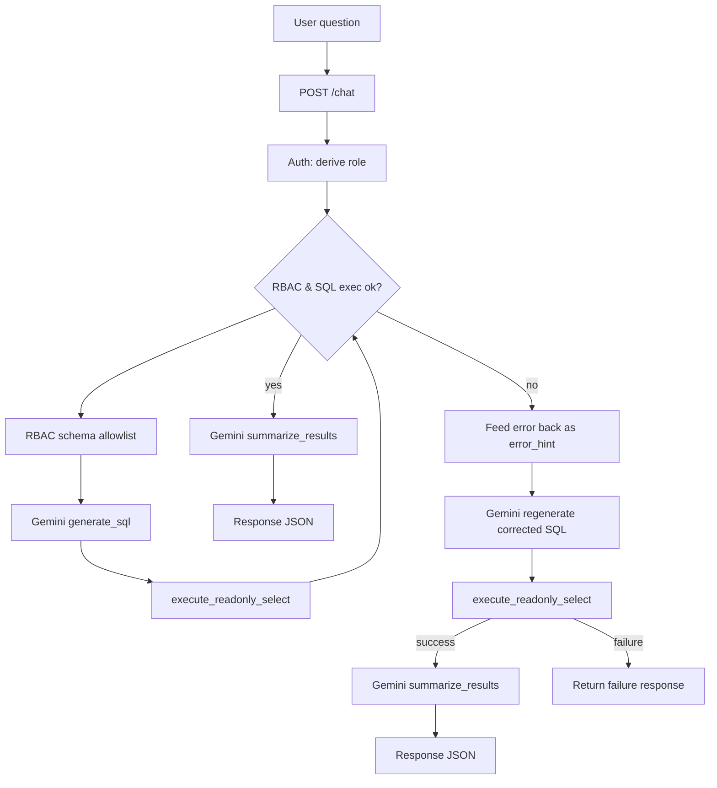

# text2sql-conversational-postgres

Natural-language-to-SQL chatbot for an e-commerce dataset.

- Frontend: React 18 + Vite + TypeScript + Recharts
- Backend: FastAPI (Python 3.11+) + asyncpg (PostgreSQL)
- LLM: Google Gemini (Gemini API) for NL→SQL + answer(retrieved data) analysis & summarization
- DB: PostgreSQL 15+

## Quickstart (local)

### 1) Configure environment
Copy `.env.example` to `.env` and set `GEMINI_API_KEY`.

```bash
cp .env.example .env
```

### 2) Start PostgreSQL
```bash
docker compose -f docker-compose.db.yml up -d
```

### 3) Seed database
```bash
docker compose -f docker-compose.db.yml run --rm backend python -m backend.scripts.seed_db
```

### 4) Run backend
```bash
docker compose up --build
```

Backend will be available at: `http://localhost:8000`

### 5) Run frontend
Frontend will be available at: `http://localhost:5173`

## Ask /chat
POST `http://localhost:8000/chat`

Request:
```json
{ "message": "What is the average amount spent for each group of customers based on marital status?" }
```

Response:
```json
{
  "answer": "....",
  "sql": "SELECT ...",
  "data": [],
  "chart_suggested": false,
  "chart_type": "bar"
}
```

## Flow diagram




## RBAC (Admin / Staff / Customer)
The backend implements a defense-in-depth approach for role-based access.

- Authentication: `POST /chat` and `GET /schema` derive the caller role from the Bearer token via `backend/security/auth.py`.
- RBAC allow listing (schema + SQL):
  - Role-specific allowed tables/columns are defined in `backend/security/rbac_config.py`.
  - `/schema` returns a role-sanitized schema (only tables/columns allowed for that role).
  - `/chat` shapes the schema sent to Gemini based on the same allowlist.
  - `backend/db/query_executor.py::execute_readonly_select()` enforces conservative SQL allowlisting before executing.
- User experience on blocked access:
  - If the generated SQL is blocked by RBAC, `/chat` returns: `You don't have access to the requested data for your role.`

- Fallback / repair loop for invalid SQL:
  - If Gemini generates SQL that fails to execute (e.g., syntax/semantic errors), `/chat` retries (up to 3 times) by passing the execution error back into the SQL-generation prompt so Gemini can regenerate a corrected query.
  - RBAC-denied queries do **not** get retried; they immediately return the role-based “no access” response.

Detailed intended permissions are documented in `RBAC.md`.


## Tests
Backend unit/route tests use `pytest`.

Test coverage focuses on:
- `backend/db/query_executor.py`: SELECT-only + forbidden keyword guardrails and statement_timeout
- `backend/llm/gemini_client.py`: `strip_sql()` parsing and prompt construction
- `backend/db/schema_cache.py`: TTL fresh vs stale refresh logic
- `backend/routes/chat.py`: `/chat` behavior for empty input, happy path, and error path (with mocks), including RBAC-blocked access messaging
- `backend/routes/schema.py`: `/schema` uses cache and always closes the DB connection (with mocks)


```bash
cd backend
pip install -r requirements.txt
pytest
```


